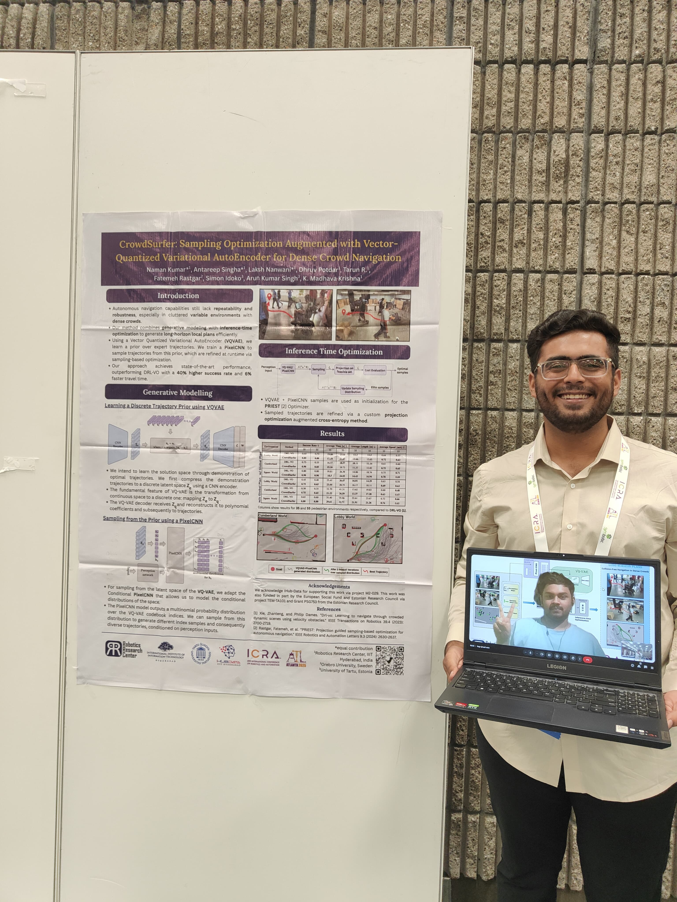

Navigation amongst densely packed crowds remains a challenge for mobile robots. The complexity increases further if the environment layout changes making the prior computed global plan infeasible. In this paper, we show that it is possible to dramatically enhance crowd navigation by just improving the local planner. Our approach combines generative modelling with inference time optimization to generate sophisticated long-horizon local plans at interactive rates. More specifically, we train a Vector Quantized Variational AutoEncoder to learn a prior over the expert trajectory distribution conditioned on the perception input. At run-time, this is used as an initialization for a sampling-based optimizer for further refinement. Our approach does not require any sophisticated prediction of dynamic obstacles and yet provides state-of-the- art performance. In particular, we compare against the recent DRL-VO approach and show a 40% improvement in success rate and a 6% improvement in travel time.

<!-- This is by far the most challenging project I have worked on and it would not have been possible without the fantastic team I had. It all started with the zeal to push for ICRA 2025. After several meetings with Prof. Arun (Uni of Tartu), we decided upon making both the previous MPC and PRIEST pipelines much more robust. The idea was to combine PRIEST(Sampling Optimizer) with Machine Learning. The PRIEST planner was already very robust and had beaten DWA, log-MPPI among other planners on its way to a RA-L publication. Making it more robust was a challenging task but we identified one major bottleneck of PRIEST.

PRIEST generated its own trajectory distribution before sampling from it and then optimizing the sampled trajectories. What if we made PRIEST pick from a distribution that was generated by a model that mimiced how a human would move the robot(in this case, the wheelchair). This would make the entire pipeline much more robust by making PRIEST optimize multi-modal trajectories.

We collected a dataset of more than 100 rosbags inside the IIIT Hyderabad campus where we moved our wheelchair prototype in a dense crowd. We trained the VQVAE using Behavior Cloning and conditioned its PixelCNN based Sampler using conditions like agent position, velocities and may more. Finally, PRIEST was provided with a pool of multi-modal trajectories and it proved to be much more robust as it beat vanilla PRIEST by more than 40%. We also beat the DRL-VO (T-RO paper) paper by a signigicant margin.

I spent some of the best times of my life while collaboratively working, brainstorming and testing our pipeline. It is very difficult for me to forget the countless nights I spent in the lab and even sometimes we would sleep under our desk.  -->

<figure>
  
</figure>